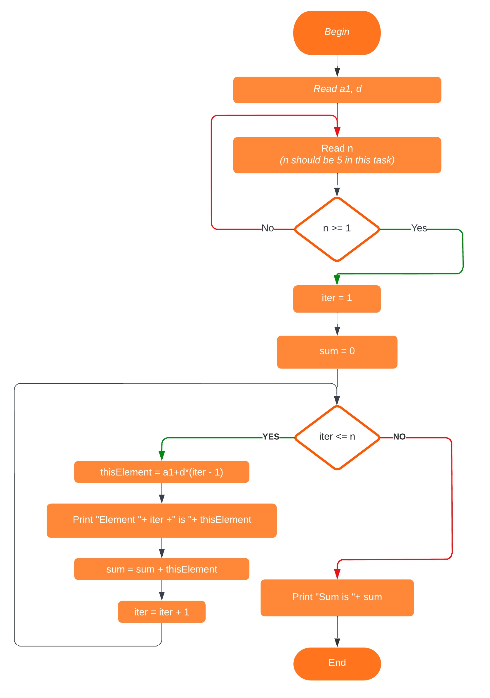

20.09.2022
# Task 6
## Scheme
*[Link](https://lucid.app/lucidchart/e0d7c026-06e3-4c2e-86ae-5f8c22951854/edit?viewport_loc=214%2C207%2C2389%2C1195%2C0_0&invitationId=inv_73e6f087-f253-4e78-a087-031fe4db0e36#)*

## Code
Run *[here](http://ibcomp.fis.edu/pseudocode/pcode.html)*: 
```
output "Enter first element of sequence:"
input a1
output "a1: ", a1
output "Enter progression difference"
input d
output "d: ", d

nIsCorrect = false
loop while nIsCorrect == false
    output "Enter last progression element number"
    input n
    output "n: ", n

    if n >= 1 then
        nIsCorrect = true
    else 
        output "n MUST BE HIGHER THAN 0!"
    end if
end loop

output "Calculating ..."

iter = 1
sum = 0

loop while iter <= n
    thisElement = a1+d*(iter - 1)
    output "Element ", iter ," is ", thisElement
    sum = sum + thisElement
    iter = iter + 1
end loop

output "Sum is ", sum
```

# Task 7
## Scheme
*[Link](https://lucid.app/lucidchart/e0d7c026-06e3-4c2e-86ae-5f8c22951854/edit?viewport_loc=214%2C207%2C2389%2C1195%2C0_0&invitationId=inv_73e6f087-f253-4e78-a087-031fe4db0e36#)*

## Code
Run *[here](http://ibcomp.fis.edu/pseudocode/pcode.html)*: 
```
nIsCorrect = false
loop while nIsCorrect == false
    output "Enter n"
    input n
    output "n: ", n

    if n >= 1 then
        nIsCorrect = true
    else 
        output "n MUST BE HIGHER THAN 0!"
    end if
end loop

output "Calculating ..."

iter = 1
sum = 0

loop while iter <= n
    thisFactorial = 1
    multiplier = 1
    loop while multiplier <= iter
        thisFactorial = thisFactorial * multiplier
        multiplier = multiplier + 1
    end loop
    sum = sum + thisFactorial
    iter = iter + 1
end loop

avgOfFactorials = sum / n

output "Avg is ", avgOfFactorials
```